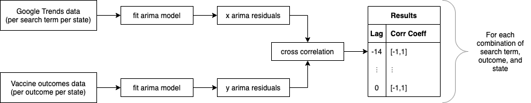

# Are Google Search Trends correlated with COVID-19 Daily Vaccination Rates? 
*An infodemiologic analysis using Google Search Trends in the COVID-19 pandemic* 

*Final project for data science for public health 2021, with Zach Murphy, Neha Anand, John Morkos, and Thomas Le* 
 
 **Find the app here: link to app here**
 
 ## Summary 
 This is a shiny app that visualizes the association between potential vaccination search terms "covid", "vaccine", "vaccine near me", "mask", "social distancing" and "qanon" with actual daily vaccination totals within the US by states from January 1st, 2021 to May 11th, 2021.
  
## App description 

### Heat Map 
This is a heat map of the contiguous 48 states that shows the correlation between a given search term with daily vaccinations. In the left bar you can choose the vaccination quantity (daily vaccinations, daily vaccinations per million), the google search term of interest, and the time lag. The heat map shows negative to positive correlations (which can theoretically range from -1 to 1). A negative correlation indicates that an increase in search term interest decreased vaccinations, and a positive correlation indicates tha an increase in search term increased vaccinations. The time lag refers to "how long" it takes for the Google search interest to propogate and cause a change in daily vaccinations. For example, a time lag of -14 indicates that we a spike in, say "vaccine", takes 14 days to then make an impact on the daily vaccination rate. 
 
### Graphs of Trends
Here, you can see a graph of daily vaccinations and Google search trends over time for easy visualization. In the left bar you can choose the vaccination quantity (daily vaccinations, daily vaccinations per million), the Google search term of interest, how you want the data visualized (raw data points, connecting lines, or a loess smoother), and a selection of up to five states. 
 
## Technical details under the hood

### Analysis 
The un-processed daily vaccination data and Google Search Trend data was first fit to an ARIMA model (https://online.stat.psu.edu/stat510/lesson/1) to account for the time series nature of this data. Then, the correlation between the two models was determined by taking the residuals from the two models and calculating a cross-correlation, or sliding dot product, to assess for positive or negative correlation. These calculations are pre-processed and not input into Shiny to save on computation. 
 
 
 
### Google Search Trends 
Google Search Trends are normalized from 0-100 within the region of interest (in this case, by state) over the time period of interest. Thus, a 100 indicates a maximum search interest within the time period specified, and 0 indicates minimal search interest within the time period specified. You can read more here (https://medium.com/google-news-lab/what-is-google-trends-data-and-what-does-it-mean-b48f07342ee8) with an interesting discussion of de-normalizing Google Trends data here (https://www.jmir.org/2020/1/e13347/).

## Data sources 
Our World in Data - Mathieu, E., Ritchie, H., Ortiz-Ospina, E. et al. A global database of COVID-19 vaccinations. Nat Hum Behav (2021). https://doi.org/10.1038/s41562-021-01122-8

Google Search Trends data downloaded using the gtrendsR R package - https://cran.r-project.org/web/packages/gtrendsR/gtrendsR.pdf
